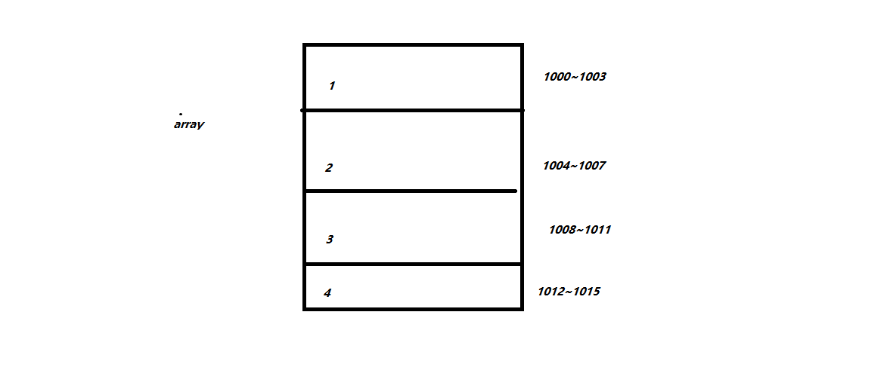

## 数组是什么
数组是一组连续内存，存储相同类型数据，并且达到随机访问(可以理解为任意访问)效果的数据结构
### 随机访问
由于数组是一段连续内存，并且存储的是相同类型的数据，所以他可以做到任意访问，我们来讲讲为什么，
先来举个例子，比如这里有个长度为4的数组array,类型为int:

我们需要访问一个元素的时候，计算机就会通过这样一个寻址公式，来找到内存地址
```code
    array[i]_address=f_address+i*arrayTypeSize
```
f_address代表的也就是这个数组的内存首地址，也就是1000，arrayTypeSize为数组元素类型的占用字节大小(int为4个字节)，这样就能达到任意访问，因为是相同类型的数据，所以他们占用的字节
是一样的，并且因为是连续内存，所以就可以根据这样的公式来计算出元素的内存地址，所以数组在直接访问一个元素下标的情况下时间复杂度是O(1),直接定位到内存地址，效率非常高。
### 插入和删除效率为什么低效
#### 插入
假如数组长度为n，插入位置为k，为了保证数组的有序，需要移动k~n位置的数据，所以假如k是元素末尾，就不需要移位数据，那么插入的时间复杂度为O(1).如果是插入在其他可能的位置，
那么时间复杂度就位O(N),k为数组每个位置的可能性都为1/2，平均时间复杂度为O(N)，如果数组无需保证有序，那么就可以直接把要插入位置的元素移位到最后，而这个元素可以直接覆盖
之前的元素，这时时间复杂度为O(1)
#### 删除
删除，时间复杂度和插入一样，因为都是需要移位数据，同样，假如无需保证数组的有序性，我们可以暂时标记这个元素被删除，等到数组大小被占满，再统一删除，这样就减少了频繁移位的操作
(ps:jvm标记清除算法类似)
## 容器和数组有什么区别
比如arraylist，他和数组的区别在于封装了数组的很多优化性操作，比如动态扩容和前面提到的移位数据，当然，使用这种连续内存的数据结构最好还是事先预定好大小，避免扩容，扩容后也是
消耗性能的一个地方，另外这种封装的容器比起数组多了一些拆箱和装箱的操作，性能比数组略低一些。


