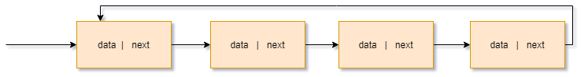

## 链表是什么
和数组一样，链表也是一种线性表，但是，链表是一组非连续内存，通过指针来连接节点的数据结构
### 单向链表
单向链表每个节点是由数据和后继指针组成(可以称做数据域和指针域),后继指针指向下一个节点的内存地址,比如这个有四个节点的单链表

其中，头结点(头结点数据域无信息，指针域指向第一个节点)记录链表基地址，尾节点指向null，代表链表已经结束，这样就可以完成一次链表遍历。
> Tips:指针存储所指对象的内存地址
### 循环链表
循环链表和单向链表的区别就是尾节点不再指向null，而是指向头结点，如下图:

### 双向链表
双向链表和单向链表的区别就是增加了前驱指针指向上一个节点，如图:

这么做的目的是为了利用空间节约时间，比如当你需要获取上一个元素的这种操作
- 在某个位置插入或者删除某个元素

这种情况如果是单向链表就会先找到这个元素，然后清掉这个元素，但是同时需要改变前驱节点的next指针，这时候有两种可能，第一种再从指针头结点到当前位置进行一次遍历，
或者删除时记录下每一个元素的上一个元素，这时候是没有双向链表直接找到前驱节点更为合适，另外双向链表有了前驱节点和后继节点，有些情况下采用二分法来查找，效率会更高
### 双向循环链表
也就是双向链表和循环链表的结合体..
### 时间复杂度
链表查询复杂度为O(N)，因为他并不是连续内存，所以不能和数组一样直接去寻址，插入和删除复杂度为O(1)(这里指的O(1)是指不会造成大量数据移位，不包括遍历数据),同理，因为他不是连续内存，不需要
大量移位数据，只需要更改受影响节点的指针。
## 带头链表
为了不在代码中写入的时候对空链表做额外处理，可以初始化一个节点，叫做哨兵节点，数据域并不存储数据。
## 反转单链表
```code
package com.cmai.common;

/**
 * @author cmai
 * @desc 单向链表反转
 */
public class Node {
    private Object data;
    private Node next;

    public Node(Object data) {
        this.data = data;
    }

    public Node(Object data, Node next) {
        this.data = data;
        this.next = next;
    }

    public Object getData() {
        return data;
    }

    public void setData(Object data) {
        this.data = data;
    }

    public Node getNext() {
        return next;
    }

    public void setNext(Node next) {
        this.next = next;
    }

    public static void main(String[] args) {
        Node n1 = new Node("1");
        Node n2 = new Node("2");
        Node n3 = new Node("3");
        n1.next=n2;
        n2.next=n3;
        System.out.println("链表"+n1.getData()+n1.getNext().getData()+n1.getNext().getNext().getData());
        Node reverseNode =reverseLinkedList(n1);
        System.out.println("反转后"+reverseNode.getData()+reverseNode.getNext().getData()+reverseNode.getNext().getNext().getData());

    }
    public static Node reverseLinkedList(Node node){
        /** 确定链表不为空且链表中元素大于1**/
        if (node == null || node.getNext() == null){
            return node;
        }
        Node prevNode = null;
        Node currentNode = node;
        Node nextNode = null;
        /**
         * 反转流程,
         * 1.先拿到下一个节点
         * 2.把当前节点的后继设置为上一个节点
         * 3.上个节点再重新刷新为当前节点(第一次为null)
         * 4.当前节点刷新为下一个节点
         * data: 1 2 3
         * 1 > null
         * 2 > 1
         * 3 > 2
         */
        while (currentNode!=null){
            nextNode=currentNode.next;
            currentNode.next=prevNode;
            prevNode=currentNode;
            currentNode=nextNode;
        }
        /** 返回最后一次需要反转的节点 **/
        return prevNode;
    }
}

```
## 有序链表合并
...
## 链表实现LRU缓存淘汰策略
...

