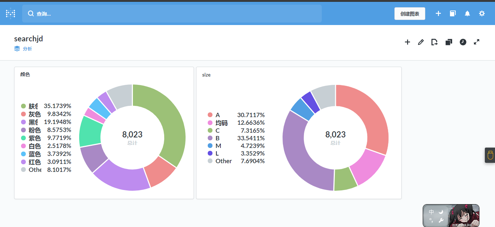

## 分析京东内衣销售记录
前段时间在掘金看到了一个帖子[掘金链接](https://juejin.im/post/5d39d75d518825542956dcd6?utm_source=gold_browser_extension),觉得很有意思，遂用java开始上手，参考了其中的思路，比如data-pid(注:这个不好找，京东貌似每种商品他的产品id不是一样的字段)
## 表结构
```code
CREATE TABLE `comment_info` (
  `id` int(11) NOT NULL AUTO_INCREMENT,
  `product_id` varchar(50) DEFAULT NULL,
  `comment_goods_size` varchar(255) DEFAULT NULL,
  `comment_goods_color` varchar(255) DEFAULT NULL,
  `comment_content` varchar(500) DEFAULT NULL,
  `creation_time` varchar(200) DEFAULT NULL,
  `goods_name` varchar(255) DEFAULT NULL,
  PRIMARY KEY (`id`)
) ENGINE=InnoDB AUTO_INCREMENT=12957 DEFAULT CHARSET=utf8;
```
## 实现思路
使用jsoup拿到所有商品的产品id，然后根据产品id去遍历每个产品下的评论，通过解析json拿到其中关键字段，比如颜色，大小然后入库到mysql
## 实现过程中的踩坑
1. 在查询产品的评论的时候，有些评论中会有div标签，包含图片地址，jsoup并不会把他当作一个字符串，而是一个标签，所有解析json失败，转为httpclient方式调用
2. ip长时间快速的访问京东的接口会导致连接超时，加上了线程休眠后，依然会有这种情况，遂用代码去抓取西刺的代理ip，生成ip池去调用接口
3. 访问西刺503，服务不可用，初步怀疑西刺可能也做了限制，所以加了重试机制
4. 访问产品评论的接口header需要加上referer，value值前缀必须是jd的域名，如
``` code
https://item.jd.com/referer.html
```
## 核心代码
### 查找商品
```code
  /**
     * 查询商品id
     * @param startPage 起始页
     * @param page 页数
     * @param goods 商品名
     * @return
     * @throws IOException
     */
    public List<String> searchGoodsId(int startPage,int page,String goods) throws IOException {
        List<String> goodsId = new ArrayList<String>();
        for (int i = startPage; i <=(startPage+page); i++) {
            Integer currPage = i;
            Connection.Response jdResponse = Jsoup
                    .connect(url)
                    .header("User-Agent", "Mozilla/5.0 (Windows NT 6.1; WOW64; rv:29.0) Gecko/20100101 Firefox/29.0")
                    .data("keyword", goods)
                    .data("enc", "utf-8")
                    .data("page", currPage.toString())
                    .ignoreContentType(true).method(Connection.Method.GET)
                    .execute();
            Document document = jdResponse.parse();
            Element el = document.body();
            Elements es = el.getElementsByAttribute("data-pid");
            for (Element e : es) {
                goodsId.add(e.attr("data-pid"));
            }
        }
        return goodsId;
    }
```
### 查找评论然后入库
```code
    /**
     * 按照产品id查找评论并且入库
     * @param goodsId
     * @param startCommentsPage
     * @param commentsPage
     */
    public void saveCommentInfoByPId(List<String> goodsId,int startCommentsPage,int commentsPage){
        try {
            for(int k = 0;k<goodsId.size();k++){
                String productId = goodsId.get(k);
                for (int j = startCommentsPage;j<(startCommentsPage+commentsPage);j++) {
                    String searchGoodsUrl = "https://sclub.jd.com/comment/productPageComments.action?callback=fetchJSON_comment98vv855&productId=" +productId+"&score=0&sortType=5&page="+j+"&pageSize=10&isShadowSku=0&rid=0&fold=1";
                    //休眠一段时间避免一个ip很快就被刷掉
                    Thread.sleep(500);
                    logger.info(searchGoodsUrl);
                    HttpGet httpGet = new HttpGet();
                    httpGet.setHeader("referer",refererUrl);
                    httpGet.setURI(new URI(searchGoodsUrl));
                    String fetchJson = HttpUtils.sendHttpGet(httpGet);
                    fetchJson=fetchJson.replace("fetchJSON_comment98vv855(","");
                    if(StringUtil.isBlank(fetchJson)){
                        continue;
                    }else {
                        fetchJson = fetchJson.substring(0, fetchJson.length() - 2);
                        Gson gson = new Gson();
                        Map<String, Object> parseJson = gson.fromJson(fetchJson, Map.class);
                        ArrayList<LinkedTreeMap> commentsList= (ArrayList) parseJson.get("comments");
                        for (LinkedTreeMap treeMap: commentsList) {
                            String productSize = (String) treeMap.get("productSize");
                            String productColor = (String) treeMap.get("productColor");
                            String content = (String) treeMap.get("content");
                            String creationTime = (String) treeMap.get("creationTime");
                            String referenceName = (String) treeMap.get("referenceName");
                            CommentInfo commentInfo = new CommentInfo();
                            commentInfo.setProductId(productId);
                            commentInfo.setCommentContent(content);
                            commentInfo.setCommentGoodsColor(flushData(productColor));
                            commentInfo.setCommentGoodsSize(flushData(productSize));
                            commentInfo.setGoodsName(referenceName);
                            commentInfo.setCreationTime(creationTime);
                            dbUtils.insertCommentInfo(commentInfo);
                        }
                    }
                }
            }
        }catch (JsonSyntaxException e){
            e.printStackTrace();
        }catch (Exception e){
            e.printStackTrace();
        }
    }
```
### 发送httpget请求，使用ip池
```code
    private static int retryCount = 0;
    private static int retryMaxCount=5;
    public static String sendHttpGet(HttpGet httpGet)  {
        IPBean ipBean=null;
        boolean isNotAvailable=true;
        //上次的ip还能使用就继续使用
        if(currIpBean!=null&&IPUtils.isValid(currIpBean)){
            ipBean=currIpBean;
            isNotAvailable=false;
        }
        while (isNotAvailable){
            ipBean=IPList.get();
            if(ipBean!=null){
                if(IPUtils.isValid(ipBean)){
                    isNotAvailable=false;
                    currIpBean=ipBean;
                    ProxyUtis.setGlobalProxy(ipBean);
                }else {
                    IPList.remove(ipBean);
                }
            }else {
                //可用ip已无
                IPUtils.initAvailableIp();
            }
        }
        CloseableHttpClient httpClient = null;
        CloseableHttpResponse response = null;
        HttpEntity entity = null;
        String responseContent = null;
        try {
            httpClient = HttpClients.createDefault();
            httpGet.setConfig(requestConfig);
            response = httpClient.execute(httpGet);
            entity = response.getEntity();
            responseContent = EntityUtils.toString(entity, "UTF-8");
        } catch (Exception e) {
            if(retryCount>=retryMaxCount){
                e.printStackTrace();
            }else {
                retryCount++;
                try {
                    Thread.sleep(500);
                } catch (InterruptedException e1) {
                    e1.printStackTrace();
                }
                //可能ip已经被封掉，连接超时，此时去掉此ip，下次再进来就不会继续使用此ip了
                IPList.remove(ipBean);
                currIpBean=null;
                return sendHttpGet(httpGet);
            }
        } finally {
            try {
                // 关闭连接,释放资源
                if (response != null) {
                    response.close();
                }
                if (httpClient != null) {
                    httpClient.close();
                }
            } catch (IOException e) {
                e.printStackTrace();
            }
        }
        return responseContent;
    }
```
## 结论
第一次用java来写这种爬虫，学习到了很多东西，然后代码也没有写的很优雅，哈哈，我们来看一下分析的八千条评论数据
,在以八千条数据为基数的分析上，肤色和B cup是占比最高的
