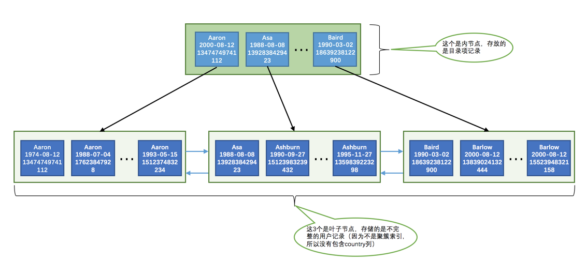

## 前言
参考资料:[innodb存储结构](https://github.com/jeremycole/innodb_ruby),[MySQL是怎样运行的:从根上理解MySQL](https://juejin.im/book/5bffcbc9f265da614b11b731/section/5bffdbf06fb9a049f570dc4f#heading-1)
## 数据页
innodb将数据划分为一个个数据页，数据页大小为固定16kb，因为处理数据是在内存中，读取和把数据刷新到磁盘上，以页的形式来而不是一行行记录的形式，
这样处理起来更高效
> 各个数据页可以组成一个双向链表，而每个数据页中的记录会按照主键值从小到大的顺序组成一个单向链表，每个数据页都会为存储在它里边儿的记录生成一个页目录，在通过主键查找某条记录的时候可以在页目录中使用二分法快速定位到对应的槽，
然后再遍历该槽对应分组中的记录即可快速找到指定的记录
## 索引
### 前置
每个索引都对应一棵B+树，B+树分为好多层，最下边一层是叶子节点，其余的是内节点。所有用户记录都存储在B+树的叶子节点，所有目录项记录都存储在内节点。

InnoDB存储引擎会自动为主键（如果没有它会自动帮我们添加）建立聚簇索引，聚簇索引的叶子节点包含完整的用户记录。

我们可以为自己感兴趣的列建立二级索引，二级索引的叶子节点包含的用户记录由索引列 + 主键组成，所以如果想通过二级索引来查找完整的用户记录的话，需要通过回表操作，也就是在通过二级索引找到主键值之后再到聚簇索引中查找完整的用户记录。

B+树中每层节点都是按照索引列值从小到大的顺序排序而组成了双向链表，而且每个页内的记录（不论是用户记录还是目录项记录）都是按照索引列的值从小到大的顺序而形成了一个单链表。如果是联合索引的话，则页面和记录先按照联合索引前边的列排序，如果该列值相同，再按照联合索引后边的列排序。

通过索引查找记录是从B+树的根节点开始，一层一层向下搜索。由于每个页面都按照索引列的值建立了Page Directory（页目录），所以在这些页面中的查找非常快。
### 聚簇索引
mysql会针对主键创建聚簇索引，不指定主键，mysql会为你创建主键
聚簇索引的形式为二叉树的结构，叶节点也就是一个个数据页作为节点，用来
存放用户的实际记录数据，按照主键大小排序形成单链表，内节点存放目录项页，节点与节点之间按照索引列形成双向链表，
然后这时候就可以通过主键查找根节点，找到到目录项页，再查找到目录项，然后找到具体的数据页，通常使用二分法来做查找
参考mysql三层的b+tree示意图:

### 二级索引和联合索引
其他的手动创建的索引可以称为二级索引，内节点是由索引列排序后组成双向链表构成的目录，
但是这种二级索引的记录数据只会存储索引列和主键，在找到这个列后会拿主键去做一次回表操作，也就是再去聚簇索引查一遍，
对于联合索引来说，内节点存储的是所有联合键排序后的目录项，记录数据存储的是联合键和主键，也是需要做回表操作
### 联合索引为什么需要满足最左前缀
因为联合索引的排序是把字段从左到右排序的，如果没有最左边的条件的话，那么其他字段有可能是乱序的，这个时候就用不到索引，
比如假如有name，date，phone三个字段，name字段值一样就按照date排序，date一样就按照phone排序，假如条件没有了name，那么date可能并不是有序的
参考此图:

### 联合索引还有什么注意的地方
联合索引如果想要达到最优效果，最好使用从左到右连续的列，比如abc三个列，如果只使用了a和c，跳过了b，那么最终将只会使用a这个列
### 索引的劣势
占用更大的存储空间，每创建一个索引，都会创建一个b+tree，而每个b+tree都会有很多很多的数据页组成，每个数据页16kb，数据量大的话，
索引的体积也会很庞大，时间上，每次一次增删改都有可能会触发记录移位，页分裂等来保证索引列在节点和记录上的顺序性，这样就会影响性能
### 列前缀匹配
比如a列为字符串类型，那么他在建立索引的时候，排序规则是这样的:先比较第一个字符，第一个字符一样就逐一比较接下里的字符，直到确定大小.
所以我们假如这样写查询语句:
```code
select * from source where a like "tt%";
```
是可以快速定位记录的，因为他的前缀是排序好的，假如是:
```code
select * from source where a like "%tt%";
```
这种匹配中缀类型的查询语句或者匹配后缀的话，mysql就无法使用索引，就是因为不确定后续的有没有排序过，部分场景可以采用逆序存储来保证前缀匹配
> 字符串比较规则根据字符集来确定
### 列范围匹配
联合索引如果对多个列同时进行范围查找的话，只有对索引最左边的那个列进行范围查找的时候才能用到B+树索引，
如果左边的列是精确查找，则右边的列可以进行范围查找
### 排序
使用order by时，如果不走索引列会在内存中利用排序算法进行排序，内存空间不足的话，还会借用磁盘，这样速度是很缓慢的，
而如果走索引，由于索引本身就是排序好的，可以直接通过索引拿到主键然后走回表操作，需要注意的是，如果使用联合索引排序，则从左到右的顺序不能颠倒，和上面讲的同理。
所有排序列需要统一排序规则，否则复杂的算法说不定还不如直接排序，所以mysql规定了排序列要统一为升序或者降序，如果WHERE子句中出现了非排序使用到的索引列，
那么排序依然是使用不到索引的，排序列也不应使用表达式。
### 分组
索引用于分组和排序规则类似
### 回表
前面我们讲了，二级索引找到主键要去聚簇索引做回表，回表也是一个消耗性能的地方，因为二级索引的记录数据本身是排序好的，这时候读就是顺序I/O，
而去回表去聚簇索引查的时候，就会分散在很多数据页中，数据页并不是连续的，这时候就叫做随机I/O，二级索引所查出的记录数越多，也就是需要回表的
数据越多，随机I/O的次数理论上来说就更多，甚至还不如不使用二级索引，所以mysql的查询优化器，就会在统计你需要回表的记录数，多的时候直接采用聚簇索引，
也就是全表扫描，省去了回表操作，所以允许的情况下，多使用limit，优化器就会更倾向于使用二级索引
### 覆盖索引
```code
select a from source where a > "100"
```
比如这个sql，a这个字段建立了索引，然后去二级索引查询这个范围的数据，由于二级索引的记录保存了索引列和主键，而我们需要查询的列仅仅只
使用到了这个索引列，这个时候就不用回表了，减去了回表的消耗。
### 如何选择索引
    1. 为搜索，排序，分组列创建索引，比如where条件，join列，order by，group by
    2. 考虑列的基数，列的基数指的也就是列不重复的数据数，基数越小越没有必要建立索引，比如a列默认值为0，200条数据，199条都是0，那这个列的基数就是2，那这个时候创建二级索引再去排序就没有太大意义，反而使用了这个二级索引会造成回表。
    3. 索引的数据类型表示的大小尽量越小越好，效率会快，而且索引占用空间会少
    4. 索引字符串尽量使用前缀来限制索引的字符个数，但是这样会导致排序无法使用这种索引。
    5. 索引列以单独形式出现，表达式不会使用索引
### 插入顺序
因为数据页是按照主键进行排序和分割，插入的时候主键顺序尽量依次递增，否则页分裂可能就会比较严重，造成性能损耗，建议使用自增
