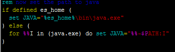

## 日志收集处理ELK6.X实战
## 为什么要用到ELK
一般我们排查直接在日志文件中 grep、cat 就可以获得自己想要的信息。但在规模较大的场景中，此方法效率低下，面临问题包括日志量太大如何归档、文本搜索太慢怎么办、如何多维度查询。
而且一般大型系统是一个分布式部署的架构，不同的服务模块部署在不同的服务器上，问题出现时，大部分情况需要根据问题暴露的关键信息，定位到具体的服务器和服务模块，构建一套集中式日志系统，可以提高定位问题的效率
## ELK是什么
ELK是三个开源软件的缩写，分别表示：Elasticsearch , Logstash, Kibana , 它们都是开源软件。
## 他们是做什么的
Elasticsearch是目前流行的搜索引擎,在ELK中用于分布式存储和检索;<br/>
Logstash 用于过滤,收集和格式化日志;<br/>
kibana 用于web展示，分析日志;<br/>
## Logstash优化
由于了解到Logstash是用jvm运行，而且吃的内存较多，于是决定Logstash只是作为格式化和过滤日志，收集日志使用FileBeat完成, filebeat是用golang写的一套东西，占用	内存几乎可以忽略不计
## 此次使用ELK的背景
公司服务器迁移，迁移过后查看日志非常不方便，需VPN,堡垒机(还是一次性会话号),UKEY(证书),而且公司对于日志的排查和管理，确实需要一个集中管理,现在有三台应用服务器，一台BI报表服务器(有空也写一下我搭建部署BI报表的记录),
还有一些诸如，mysql，redis，zookeeper之类的服务器，需要集中管理
## 大致思路
filebeat监控各个日志目录下的文件,一旦监控到有变动更新时，把内容发往logstash,logstash作为中间件,对日志进行分析，排版,发往es中存储数据，最终kibana从es中读取数据展示日志
## 准备工作
从[官网](http://www.elastic.co/cn/)中下载 elk+filebeat的tar包，然后解压
### Elasticsearch的部署和启动
es不做任何配置，新版es需1.8以上jdk环境,如果服务器已部署好1.7的环境，那么可以单独给es配置1.8的环境，先创建环境变量，
然后修改bin目录下的启动脚本<br/>
bin目录下elasticsearch -env.bat:
<br/>

<br/>
这里的es_home是我自己配置的1.8的环境变量,然后./elasticsearch 启动es然后报错,ES需要非ROOT账户，另外创建一个账户，赋予es文件夹的权限，然后启动，可以了
### Logstash的部署和启动
#### logstash三大组件
```code
    input{
        beats{
            port:5044
        }
    }
```
input组件，开放5044端口用于接收filebeat输出的日志
