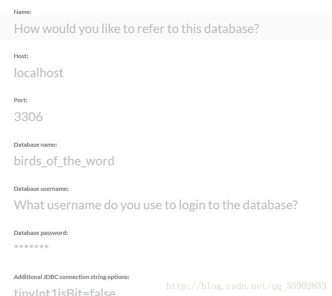
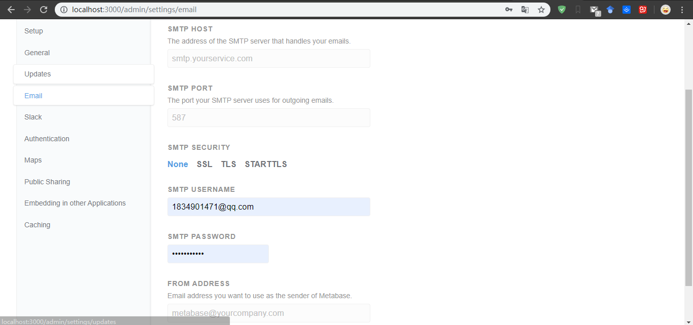
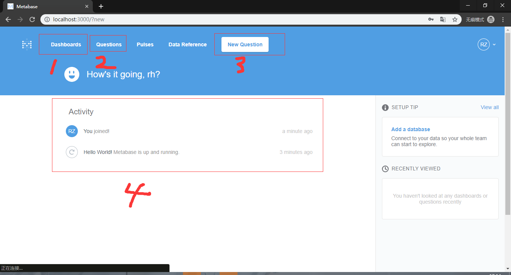

## 使用场景
公司运营需要报表统计数据，自己私下找过几个报表工具，例如Ireport,fenereport,Echarts 等等，感觉都不合心意，最终找到了metabase，
### metabase的优势
一个开源BI报表工具,metabase适合给产品和运营看统计数据,因为之前的报表是在系统当中，上线一个报表功能太麻烦，后端，前端，再测试，
用了metabase以后可以节省开发周期，节约成本，简单易上手，快速调整sql
## 开始使用
公司数据库是mysql，在官网下载好jar包(本次直接以jar文件部署启动,[下载地址](https://www.metabase.com/start/jar.html))，放到服务器上执行，第一次执行时候报错，无法分配内存，于是指定内存1024M执行此jar文件，成功运行，运行结束后服务器端口未开，于是去开启3000端口(metabase默认端口3000) <br/>
开启后通过公司服务器域名+端口号(本地通过localhost:3000)访问metabase向导设置,设置一个管理员账户的名称用户等相关信息
### 数据源设置

第一行为数据源名称，随便起，主要是给自己看，我是用来区分生产和测试环境。其次，数据源地址，端口号，数据库名字，数据库管理员帐号密码，以及一些其他连接字符串，例如中文乱码过滤，这些东西设置好以后会进入设置页面
### email设置

设置你邀请新成员进入metabase的发送邮件的来源email ，公司之前用的是阿里的企业邮箱，就拿这个举个例子吧
阿里企业邮箱的smtphost是smtp.mxhichina.com,ssl加密的端口为465，下面鉴权的帐号密码是你的企业邮箱的帐号密码<br/>
设置好以后就可以通过invite team members 填写新成员的名字和邮箱地址邀请他加入你的team，邀请新成员进入时可以设置他的所在分组，分组具有相应权限可以自己设置
## metabase功能

第一个是看板，用于运营和产品观察数据，第二个是报表的集合，第三个是添加一个新的报表,报表集合中也可以设置相应的权限，对应权限的分组，限制访问。通过sql写出的报表可以有多种展示的样式，例如折线图，柱状图，折线图对比，表格等等,
第四个会按照时间排序最新的工作流，比如有人加入了metabase，有人创建了新的报表
<br/>
其他的一些权限，分组，角色，邀请新的成员就很简单了，自己摸索一下就可以了.
## 问题
当时还遇到一个问题，当时由于某种原因重启了此jar包服务，重新打开metabase后发现以前数据全部丢失，需要重新设置向导，翻阅官网后无答案，翻阅github后找到答案<br/>
```code 
MB_DB_FILE=metabase.db java -jar metabase.jar
```
metabse在运行的时候写入的数据都会存在一个db里 名字为metabase.db.mv.db 启动的时候指定以这个数据文件启动就好(注意，不要加.mv.db 直接就是.db启动)， 如果jvm无法分配内存，需要指定内存
## 文档
[官网教程](https://www.metabase.com/docs/v0.27.2/setting-up-metabase.html)

[官网](https://www.metabase.com/)

[github地址](https://github.com/metabase/metabase)


***
> 2018-5-14

1.发现了另一妙用，如果数据库服务器是在内网的话，可以把metabase也部署在同一服务器，数据源直接设置为本机，这样查数据就不必连接vpn了(笔者是开发，非运维，用作日常的一些查看数据库,观测数据变化等需求,省的挂载vpn后进入内网再连接db)

2.可以做一个备份数据库供作metabase的查询(如果数据要求不是实时的话)  ,这样就可以开启查询缓存后，大大提高缓存的命中率