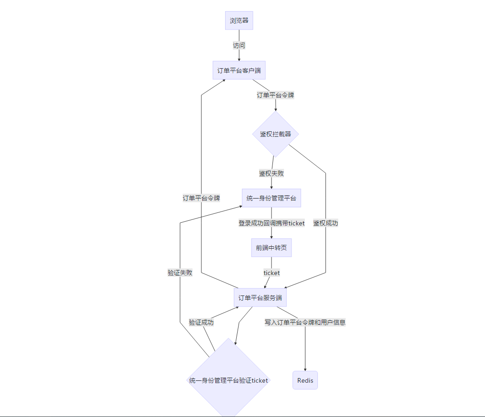

## CAS方式的SSO对接
### 流程图

### 鉴权
```code
import com.alibaba.fastjson.JSON;
import com.ruijie.op.common.bo.UserBO;
import com.ruijie.op.common.enums.ResultModelEnum;
import com.ruijie.op.common.result.Result;
import lombok.extern.slf4j.Slf4j;
import org.redisson.api.RBucket;
import org.redisson.api.RedissonClient;
import org.springframework.beans.factory.annotation.Autowired;
import org.springframework.beans.factory.annotation.Value;
import org.springframework.stereotype.Component;
import org.springframework.web.servlet.ModelAndView;
import org.springframework.web.servlet.handler.HandlerInterceptorAdapter;

import javax.servlet.http.HttpServletRequest;
import javax.servlet.http.HttpServletResponse;
import java.io.IOException;
import java.io.PrintWriter;
import java.util.concurrent.TimeUnit;

/**
 * @author zrh
 * @date 2021/10/29 14:59
 */
@Slf4j
@Component
public class RequestHeaderContextInterceptor extends HandlerInterceptorAdapter {

    private static final String HEAD_TOKEN = "token";
    @Autowired
    private RedissonClient redissonClient;

    @Value("${cas.server-login-url}")
    private String serverLoginUrl;


    @Override
    public boolean preHandle(HttpServletRequest request, HttpServletResponse response, Object handler) throws Exception {
        String token = request.getHeader(HEAD_TOKEN);
        RBucket<UserBO> userBORBucket = redissonClient.getBucket(token);
        if (token == null || userBORBucket.get() == null) {
            Result result = new Result();
            result.setData(serverLoginUrl);
            result.setStatus(ResultModelEnum.LOGIN_EXCEPTION.getCode());
            result.setErr(ResultModelEnum.LOGIN_EXCEPTION.getMessage());
            String jsonResult = JSON.toJSONString(result);
            returnJson(response, jsonResult);
            return false;
        }
        //用户处于活跃状态，操作续时
        userBORBucket.expire(8, TimeUnit.HOURS);
        UserBO userBO = userBORBucket.get();
        new RequestHeaderContext(userBO.getUserId(), userBO.getUserName(), userBO.getDeptCode());
        return super.preHandle(request, response, handler);
    }

    private void returnJson(HttpServletResponse response, String result) throws Exception {
        PrintWriter writer = null;
        response.setCharacterEncoding("UTF-8");
        response.setContentType("text/html; charset=utf-8");
        try {
            writer = response.getWriter();
            writer.print(result);
        } catch (IOException e) {
            log.error("拦截器异常：{}",e);
        } finally {
            if (writer != null) {
                writer.close();
            }
        }
    }

    @Override
    public void postHandle(HttpServletRequest request, HttpServletResponse response, Object handler, ModelAndView modelAndView) throws Exception {
        RequestHeaderContext.clean();
        super.postHandle(request, response, handler, modelAndView);
    }
}
```
### 拦截器注册
```code
/**
 * @author zrh
 * @date 2021/10/29 15:02
 */
@Configuration
public class WebMvcConfig extends WebMvcConfigurerAdapter {

    @Autowired
    private RequestHeaderContextInterceptor requestHeaderContextInterceptor;

    @Override
    public void addInterceptors(InterceptorRegistry registry) {
        registry.addInterceptor(requestHeaderContextInterceptor).addPathPatterns("/**")
                .excludePathPatterns("/op/actuator/health")
                .excludePathPatterns("/login")
                .excludePathPatterns("/mtm/syncProduct")
                .excludePathPatterns("/api/v1/partner/general")
                .excludePathPatterns("/su")
                .excludePathPatterns("/api/v1/signature/electronicSignatureCallback")
                .excludePathPatterns("/api/v1/authorization-letter/Authorize/AuthorizeInfo")
                .excludePathPatterns("/api/v1/authorization-letter/Authorize/AuthorizeFileDown")
                .excludePathPatterns("/api/v1/authorization-letter/Authorize/AuthorizeReCall")
                .excludePathPatterns("/api/v1/authorization-letter/Authorize/ValidateAuthorizeFileCode")
                .excludePathPatterns("/api/v1/authorization-letter/Authorize/GetAssistantList");
        super.addInterceptors(registry);
    }
}
```
### 用户session
```code
/**
 * @author zrh
 * @date 2021/10/29 15:02
 * 用户session
 */
public class RequestHeaderContext {

    private static final ThreadLocal<RequestHeaderContext> REQUEST_HEADER_CONTEXT_THREAD_LOCAL = new ThreadLocal<>();
    //邮箱前缀
    private String userId;
    //用户名称
    private String userName;
    //当前所在部门
    private String deptCode;

    public String getDeptCode() {
        return deptCode;
    }

    public void setDeptCode(String deptCode) {
        this.deptCode = deptCode;
    }

    public String getUserId() {
        return userId;
    }

    public void setUserId(String userId) {
        this.userId = userId;
    }

    public String getUserName() {
        return userName;
    }

    public void setUserName(String userName) {
        this.userName = userName;
    }

    public static RequestHeaderContext getInstance() {
        return REQUEST_HEADER_CONTEXT_THREAD_LOCAL.get();
    }

    public void setContext(RequestHeaderContext context) {
        REQUEST_HEADER_CONTEXT_THREAD_LOCAL.set(context);
    }

    public static void clean() {
        REQUEST_HEADER_CONTEXT_THREAD_LOCAL.remove();
    }

    public RequestHeaderContext(String userId, String userName, String deptCode) {
        this.userId = userId;
        this.userName = userName;
        this.deptCode = deptCode;
        setContext(this);
    }

}
```