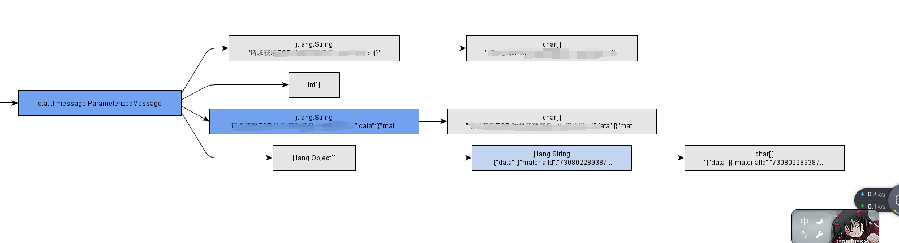

## 背景
测试环境A服务莫名停机，请求一直在pending，日志也不打印，top命令查看发现A服务CPU占用率100%以上，只有重启后才恢复，于是勾起了好奇心
## 排查过程
 1. 通过top命令拿到pid
 2. top -Hp pid，根据pid查看线程情况，如下图 
    ,可见21125和21126两个线程占用cpu极高，猜测可能是哪里代码写的不对导致线程阻塞，只要排查出线程阻塞的位置，就可以解决问题
 3. jstack pid > pid.log 导出线程当前信息，21125和21126转成16进制后在日志文件内查找，发现两条线程其实是gc线程(21125转换16进制为5285)
    ```code
    "GC task thread#0 (ParallelGC)" os_prio=0 tid=0x00007f7ebc01d800 nid=0x5285 runnable 
    "GC task thread#1 (ParallelGC)" os_prio=0 tid=0x00007f7ebc01f800 nid=0x5286 runnable 
    ```
    这就与我们最初的猜测不符，只能再去找堆栈信息
 4. jstat -gcutil pid 200 50 打印GC回收状况，发现eden和old的占用都满了，而且fgc很频繁
 5. dump出堆栈快照，打开了十天体验时间的JProfiler，把堆栈快照改为hprof后缀，用JProfiler打开，查看大对象,发现两个占用约为200m左右的字符串
    
 6. 跟踪字符串的链路如图
，发现两个大字符串均为log输出产出的，定位到代码后发现是一个job，每次会全量同步一批数据，同时也会记录日志
    ```code
    log.info("请求*****- 响应结果：{}", JSON.toJSONString(response));
    ```
## 处理结果
1. 全量数据的提供方删除无用字段，减少数据体积
2. 提升测试环境服务的配置，加大堆内存的空间
3. 删除或减少此处的数据日志，只记录RPC的状态码
4. 协调服务提供方，全量数据改为增量数据方案
