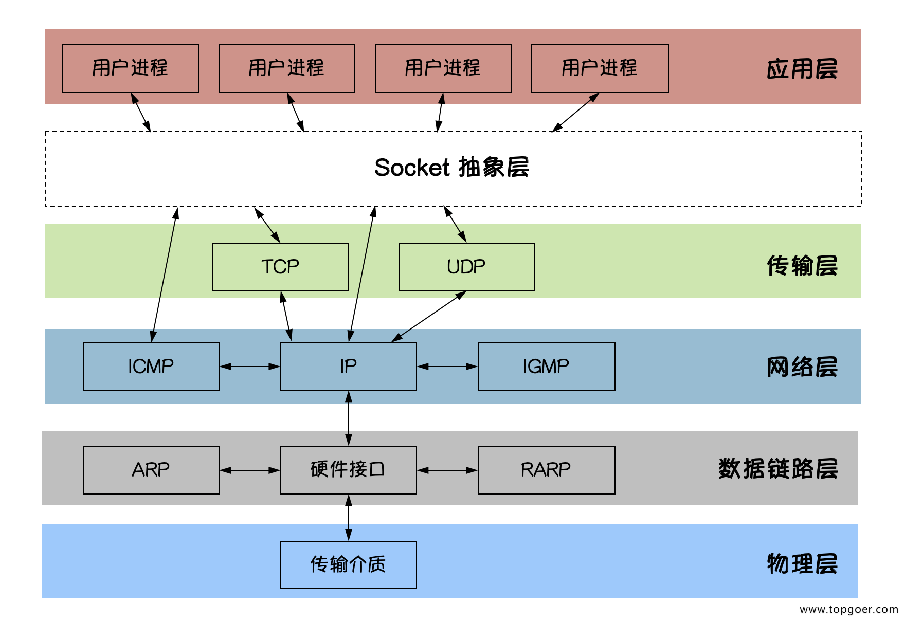

## 前言
在使用mina、netty等网络编程框架之前，我们先来聊一下socket、nio这些知识
## socket是什么？
简单来讲scoket定义了一些抽象的API，位于应用层和传输层之间，用作计算机网络中的通信，实现上是一个双向的通信机制，底层使用TCP或者UDP的协议

#### 内存溢出
## 基于TCP的socket基本工作流程

**服务端**
1. socket(),创建socket实例
2. bind(),绑定ip 端口到socket实例
3. listen(),指定监听端口，可以是多个，通常和bind一起使用，最终监听的端口由listen()决定
4. accept(),阻塞等待连接进来，阻塞机制依赖于操作系统的底层实现，类似于等待、唤醒的机制，防止过度消耗cpu资源
5. read()，处理请求,也是一个阻塞函数
6. write(),回写响应

**客户端**
1. socket(),创建socket实例
2. connect()，指定本地端口和远程的ip、端口，创建连接
3. write()，写入请求
4. read()，处理响应
## socket怎么用？

