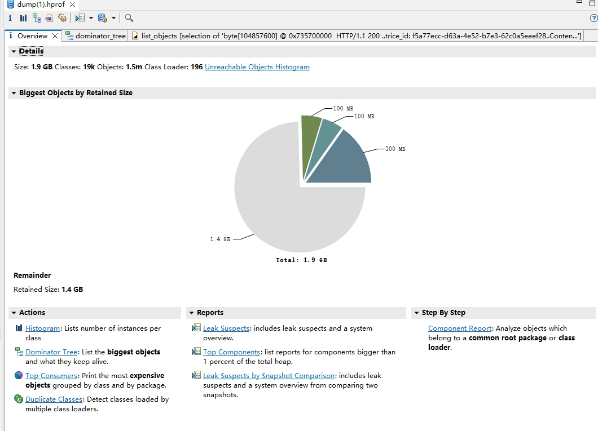
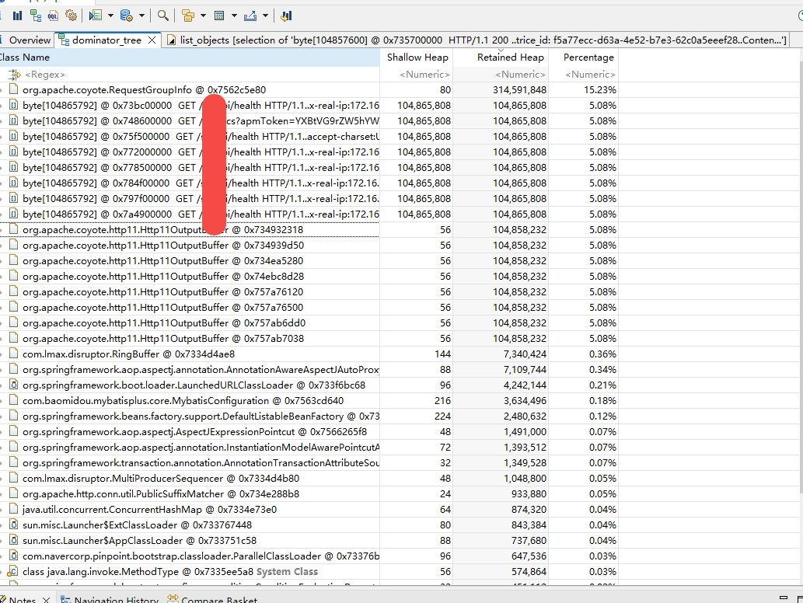
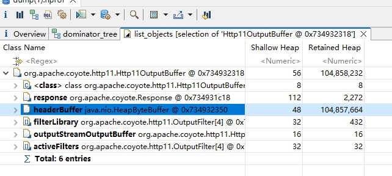
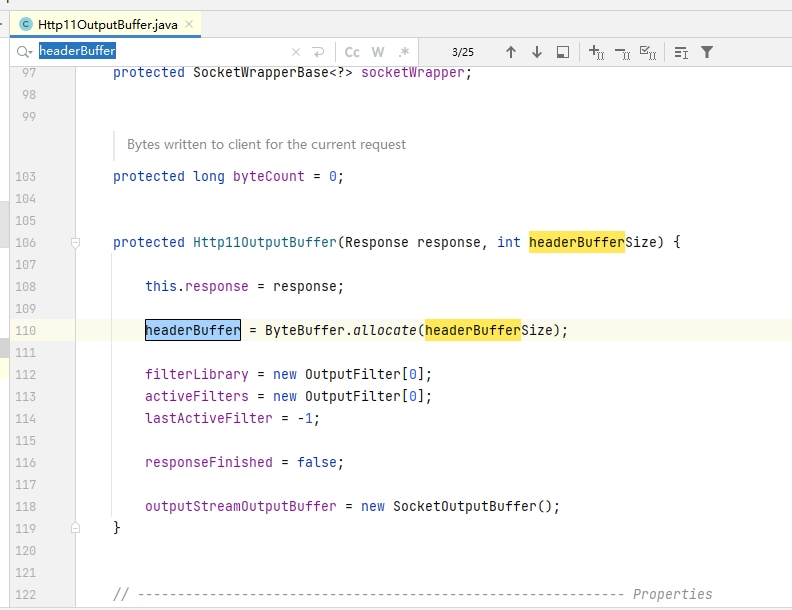

## 背景
某个项目执行压力测试， 压测的接口为简单的health检查，线程并发10的时候，日志出现OOM
```code

2023-11-16 15:49:18.047 | ERROR | project | uat | trice_id:[] | req_url:[] | method:[] | http-nio-80-exec-29 | org.apache.juli.logging.DirectJDKLog.log(DirectJDKLog.java:175) Failed to complete processing of a request
java.lang.OutOfMemoryError: Java heap space
```
## 排查步骤
先检查内存分布情况  
```code
jmap -heap <pid>
```  
没有图了，大概说下情况，新生代和老年代都占满，结合日志可以得出结论是堆的对象没法回收  

拿到dump文件
```code
jmap -dump:live,format=b,file=dump.hprof <PID>
```
**MAT打开dump文件**  

  

**展示Dominator Tree**  

  

可以看到有大量的**Http11OutputBuffer对象，持有了100M的对象引用**，查看详情，看一下持有的是哪个对象引用  

  

这里找到是**headerBuffer**对象，我们回去看java的源码  

  

headerbuffer在该类初始化的时候就申请了内存，内存大小是headerbuffer size，而header buffer size默认大小是8kb,检查了一下配置文件，发现确实有地方把他改成了100M，修改该配置再次测试无问题
```code
    /**
     * Maximum size of the HTTP message header.
     */
    private int maxHttpHeaderSize = 8 * 1024;
```
```code
server.max-http-header-size=100MB
```
## 为什么headerBuffer没有释放？
<span style="color:red">
header buffer由Http11OutputBuffer控制，而Http11OutputBuffer由tomcat的连接器控制，连接器创建的Http11OutputBuffer会继续重用，不会因为请求结束而释放
</span>