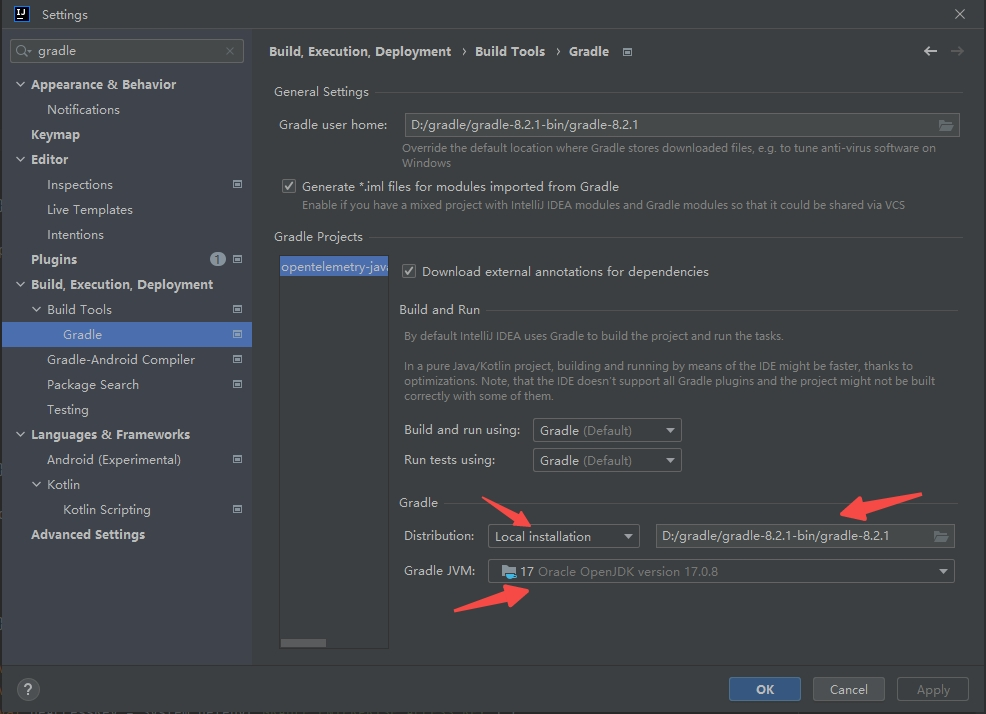

## 背景
链路追踪的技术发展目前没有多地域部署的方案，两个距离比较远的数据中心分别都部署了es来收集探针上报的数据，想聚合它的数据，展示完整的服务拓扑图需要对探针做一些扩展，来达成目的
> ps:es的跨集群搜索也是有数据上限的，往往一个服务链路过长的时候，通过es的聚合是做不到的，所以在探针层面去聚合数据
## 为什么不用opentelemetry-java-agent-extensions来实现?
尝试了，达不到效果
## opentelemetry-java-instrumentation编译
### 源码下载
https://github.com/open-telemetry/opentelemetry-java-instrumentation
### 编译中遇到的问题
#### gradle全局代理
```code
allprojects {
  repositories {
    maven {
      setUrl("https://maven.aliyun.com/nexus/content/groups/public/")
    }
    mavenCentral()
    mavenLocal()
    jcenter {
      setUrl("https://jcenter.bintray.com/")
    }
    google()
  }
}

```
#### jdk17
1.2.90版本有的包要求最低jdk17
#### 使用本地gradle

#### 内存溢出

## 开发思路