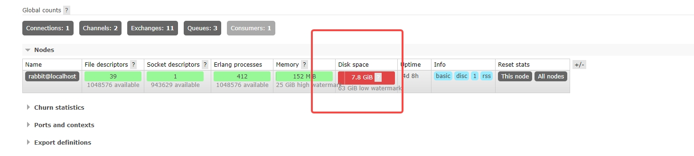
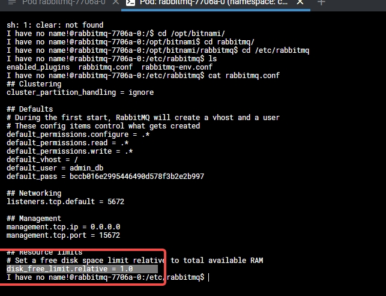

## 背景
给部门提供的rabbitmq组件是同事基于
```code
https://hub.docker.com/r/bitnami/rabbitmq
```
搭建的镜像
## 问题
客户端可以发送消息，但是mq没有接收到消息,通过mq的管理端发现磁盘一直处于异常状态

大致推断出是配置项出了问题，导致mq丢弃消息，通过log定位到conf的位置，发现了该配置

配置的含义是当磁盘小于内存时丢弃消息，比例是1.0，但是mq的镜像读取的是宿主机的内存，也就是64G，给它分配的磁盘是8G，所以一直在丢消息
## 解决
1. 调整挂载的磁盘大小
2. 删除配置
3. 基于bitnami/rabbitmq给出的可选环境变量，重新添加配置，指定预留磁盘的大小为2G或其他大小
```code
    env:
        - name: RABBITMQ_DISK_FREE_ABSOLUTE_LIMIT
            value: 2GB
```

