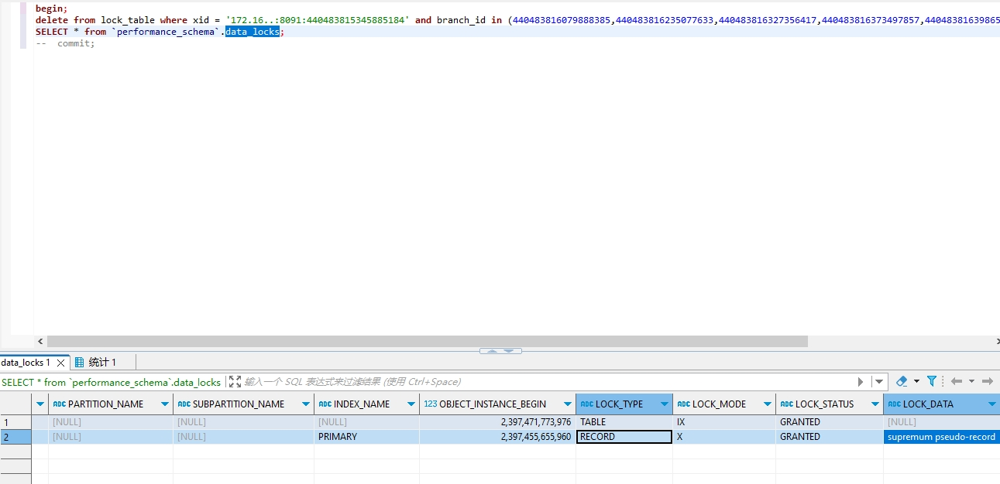

## 背景
mysql版本为5.7,在mysql的系统表中，有一个**lock_deadlocks**的指标
```code
SELECT * FROM INFORMATION_SCHEMA.INNODB_METRICS WHERE name LIKE '%deadlock%'
```
该指标的count值记录了数据库实例从启动到现在的死锁次数，我们通过普罗米修斯的mysql探针，采集了这个指标，制定了告警策略
```code
https://github.com/prometheus/mysqld_exporter
```
线上收到死锁告警后， 发现是seata at模式所用的seata库发生的死锁，同时相应的业务系统出现阻塞卡顿情况
## 排查过程
先通过命令拿到死锁的信息， 拿到后恢复系统，然后慢慢查问题
```code
show engine innodb status
```
拿到关键信息，日志比较长，贴一下关键点
```code

*** (1) TRANSACTION:
delete from lock_table where xid = '172.16..:8091:440483815345885184' and branch_id in (440483816079888385,440483816235077633,440483816327356417,440483816373497857,440483816398655489,440483816746790913,440483817065558017)
*** (1) WAITING FOR THIS LOCK TO BE GRANTED:
RECORD LOCKS space id 301 page no 6 n bits 144 index PRIMARY of table `seata`.`lock_table` trx id 338204135 lock_mode X waiting


*** (2) TRANSACTION:
insert into lock_table(xid, transaction_id, branch_id, resource_id, table_name, pk, row_key, gmt_create, gmt_modified) values ('172.16.22.13:8091:440483789588664320', 440483789588664320, 440483816818094081, 'jdbc:mysql://172.16..:3306/op', 't_order_agent_profit_explanation', '53641', 'jdbc:mysql://172.16..:3306/op^^^t_order_agent_profit_explanation^^^53641', now(), now())
*** (2) HOLDS THE LOCK(S):
RECORD LOCKS space id 301 page no 6 n bits 144 index PRIMARY of table `seata`.`lock_table` trx id 338204130 lock_mode X locks rec but not gap
*** (2) WAITING FOR THIS LOCK TO BE GRANTED:
RECORD LOCKS space id 301 page no 6 n bits 144 index PRIMARY of table `seata`.`lock_table` trx id 338204130 lock_mode X locks gap before rec insert intention waiting
```
我们来大概阅读一下这个死锁日志:
1. 第一个事务执行一个delete语句，但是他在等待一个主键索引的写锁
2. 第二个事务在执行insert语句，他现在持有一个写锁，但是在等待一个间隙锁的意向锁
到这里大致猜测一下，可能是上面的delete语句会持有间隙锁，导致和insert语句的冲突，我们先看下这个语句持有锁的情况
```code
begin;
delete from lock_table where xid = '172.16..:8091:440483815345885184' and branch_id in (440483816079888385,440483816235077633,440483816327356417,440483816373497857,440483816398655489,440483816746790913,440483817065558017);
SELECT * from `performance_schema`.data_locks;
```

这里有个关键点，**supremum pseudo-record**,这一行的意思就是对主键索引的最大索引值加锁，所以后续的insert都要等待这个锁,这里就产生竞争条件了，在并发的情况下就会出现死锁
## 解决
1. 修改隔离级别为RC，不再添加间隙锁
2. 升级seata版本，seata社区已经复现了这个bug，把数据库的链接修改为RC隔离级别了， 参照
```code
https://github.com/seata/seata/pull/5638
```