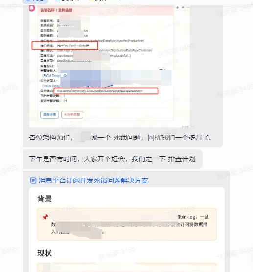

## 背景
其他组邀请我们协助排查一个死锁问题

## 思路
介入一个陌生的系统，第一步一定是从死锁日志入手，这点很重要，搞清楚是哪两个事务在冲突，不要上来就去推测问题
## 开展步骤
```code
show engine innodb status
```
拿到最近一次的dead lock日志(以下内容做了混淆，仅提取关键部分)
```code
TRANSACTION 21582416, ACTIVE 1 sec inserting
mysql tables in use 1, locked 1
LOCK WAIT 29 lock struct(s), heap size 57552, 1303 row lock(s), undo log entries 424
MySQL thread id 9048633, OS thread handle 139921052178176, query id 149704928 10.82.7.211 manager update
insert into sys_a
     ( 

        product_code) 
     values ( 
        'NG10102012' )
*** (1) WAITING FOR THIS LOCK TO BE GRANTED:
RECORD LOCKS space id 108 page no 41 n bits 760 index sys_a_product_code_IDX of table `db`.`sys_a` trx id 21582416 lock_mode X locks gap before rec insert intention waiting
Record lock, heap no 32 PHYSICAL RECORD: n_fields 2; compact format; info bits 32
 0: len 10; hex 4e473130313032303133; asc NG10102013;;
 1: len 6; hex 000007535c95; asc    S\ ;;

*** (2) TRANSACTION:
TRANSACTION 21582417, ACTIVE 0 sec inserting, thread declared inside InnoDB 5000
mysql tables in use 1, locked 1
27 lock struct(s), heap size 3520, 695 row lock(s), undo log entries 274
MySQL thread id 9048638, OS thread handle 139921057584896, query id 149704930 10.82.7.211 manager update
insert into b (*)
        values

*** (2) HOLDS THE LOCK(S):
RECORD LOCKS space id 108 page no 41 n bits 760 index sys_a_product_code_IDX of table `db`.`sys_a` trx id 21582417 lock_mode X
Record lock, heap no 32 PHYSICAL RECORD: n_fields 2; compact format; info bits 32
 0: len 10; hex 4e473130313032303133; asc NG10102013;;
 1: len 6; hex 000007535c95; asc    S\ ;;

*** (2) WAITING FOR THIS LOCK TO BE GRANTED:
RECORD LOCKS space id 214 page no 320 n bits 104 index PRIMARY of table `db`.`b` trx id 21582417 lock_mode X insert intention waiting
Record lock, heap no 1 PHYSICAL RECORD: n_fields 1; compact format; info bits 0
 0: len 8; hex 73757072656d756d; asc supremum;;

*** WE ROLL BACK TRANSACTION (2)
```
关键部分捕捉，lock_mode X locks gap before rec insert intention waiting，说明事务1在等待一个间隙锁，才能往A表插入数据，根据事物2的 HOLDS THE LOCK和WAITING FOR THIS LOCK TO BE GRANTED可以知道事务2在等待一个X锁，同事持有事务1需要的锁

这时候开始拉下他的代码，找出这样的事务代码
事务A的
1. 操作了sys_a表
2. 操作了sys_b表


事务B的
1. 操作了sys_b表
2. 操作了sys_a表

有可能是两个代码块，也可能是同一个代码块，比如本次的案例，最终定位到的就是同一个代码块，由两次不同的请求执行

1. 删除了sys_a表
2. 新增了sys_b表
3. 新增了sys_a表

A事务执行到第三步，要去拿A表的间隙锁
B事务执行到第二步，要去拿B表的X锁，形成了竞争条件

在删除a表的时候，是用非唯一字段删除的，会加上间隙锁，当A事务到第三步插入一条NG10102012的数据的时候，就被卡住了，因为B事务这时候，已经删除了NG10102013，拿到了间隙锁
