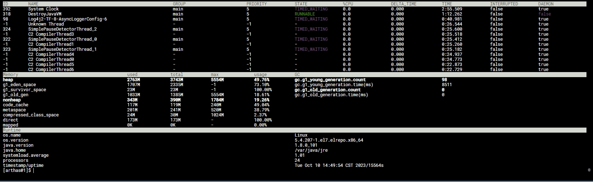

## 现象
某个项目持续运行一段时间后，内存就会超过k8s的limit限制，导致pod出现oom，然后被杀掉重启

**k8s yml文件**
```code
          resources:
            limits:
              cpu: '4'
              ephemeral-storage: 5000Mi
              memory: 8000Mi
            requests:
              cpu: 100m
              ephemeral-storage: 10Mi
              memory: 2400Mi
```
**jvm配置**
```code
-Xmx5553m -Xloggc:/data/logs/gc.log -XX:+UseG1GC
```
我们的堆大小设置的远远不到limit 8G的的上限，也就说明是非堆的内存溢出，导致超过了limit被kill掉， 通过jmap的命令也能看到
```code
root@fixed-assets-main-766e8-5cb49cf699-n94w4:/# jmap -heap 1
Attaching to process ID 1, please wait...
Debugger attached successfully.
Server compiler detected.
JVM version is 25.101-b13

using thread-local object allocation.
Garbage-First (G1) GC with 18 thread(s)

Heap Configuration:
   MinHeapFreeRatio         = 40
   MaxHeapFreeRatio         = 70
   MaxHeapSize              = 5823791104 (5554.0MB)
   NewSize                  = 1363144 (1.2999954223632812MB)
   MaxNewSize               = 3493855232 (3332.0MB)
   OldSize                  = 5452592 (5.1999969482421875MB)
   NewRatio                 = 2
   SurvivorRatio            = 8
   MetaspaceSize            = 21807104 (20.796875MB)
   CompressedClassSpaceSize = 1073741824 (1024.0MB)
   MaxMetaspaceSize         = 545259520 (520.0MB)
   G1HeapRegionSize         = 1048576 (1.0MB)

Heap Usage:
G1 Heap:
   regions  = 5554
   capacity = 5823791104 (5554.0MB)
   used     = 1195443584 (1140.0638427734375MB)
   free     = 4628347520 (4413.9361572265625MB)
   20.526896700998154% used
G1 Young Generation:
Eden Space:
   regions  = 731
   capacity = 1324351488 (1263.0MB)
   used     = 766509056 (731.0MB)
   free     = 557842432 (532.0MB)
   57.87806809184482% used
Survivor Space:
   regions  = 68
   capacity = 71303168 (68.0MB)
   used     = 71303168 (68.0MB)
   free     = 0 (0.0MB)
   100.0% used
G1 Old Generation:
   regions  = 346
   capacity = 819986432 (782.0MB)
   used     = 357631360 (341.0638427734375MB)
   free     = 462355072 (440.9361572265625MB)
   43.61430214494086% used

72670 interned Strings occupying 7916592 bytes.
root@fixed-assets-main-766e8-5cb49cf699-n94w4:/#
```
堆的使用是比较正常的，堆内存溢出我目前了解只有一种情况，就是老年代存放满了，又有新的对象需要存放，full gc也回收不掉，才会导致程序抛出OOM，但这次这个服务不是程序抛出的oom，而是k8s抛出的oom，所以可以忽略堆这块的问题
## 排查
非堆就先从元空间着手了，先看metaspace有没有问题,先挂上arthas
```code
curl -O https://arthas.aliyun.com/arthas-boot.jar
java -jar arthas-boot.jar
```
```code
heap                                             1508M            2146M           5554M            27.16%          gc.g1_young_generation.count                              426
g1_eden_space                                    888M             1281M           -1               69.32%          gc.g1_young_generation.time(ms)                           15228
g1_survivor_space                                71M              71M             -1               100.00%         gc.g1_old_generation.count                                0
g1_old_gen                                       549M             794M            5554M            9.90%           gc.g1_old_generation.time(ms)                             0
nonheap                                          341M             388M            1784M            19.17%          
code_cache                                       119M             121M            240M             49.93%
metaspace                                        198M             237M            520M             38.12%
compressed_class_space                           23M              29M             1024M            2.33%
direct                                           147M             147M            -                100.00%
mapped                                           0K               0K              -                0.00%
```
元空间也很正常，没有超出多少限制，这里看到项目里用到了direct，也就是直接内存，所以从这里开始下手  
项目开启本地内存追踪
```code
-XX:NativeMemoryTracking=detail
```
查看本地内存
```code
jcmd <pid> VM.native_memory
```
```code
root@fixed-assets-main-766e8-86878df645-hb6rc:/# jcmd 1 VM.native_memory scale=mb
1:

Native Memory Tracking:

Total: reserved=8090MB, committed=3428MB
-                 Java Heap (reserved=5554MB, committed=2146MB)
                            (mmap: reserved=5554MB, committed=2146MB)

-                     Class (reserved=1241MB, committed=246MB)
                            (classes #37596)
                            (malloc=7MB #101884)
                            (mmap: reserved=1234MB, committed=238MB)

-                    Thread (reserved=382MB, committed=382MB)
                            (thread #379)
                            (stack: reserved=379MB, committed=379MB)
                            (malloc=1MB #1915)
                            (arena=1MB #757)

-                      Code (reserved=268MB, committed=148MB)
                            (malloc=24MB #36627)
                            (mmap: reserved=244MB, committed=124MB)

-                        GC (reserved=295MB, committed=168MB)
                            (malloc=57MB #97461)
                            (mmap: reserved=238MB, committed=112MB)

-                  Compiler (reserved=1MB, committed=1MB)
                            (malloc=1MB #1359)

-                  Internal (reserved=289MB, committed=289MB)
                            (malloc=289MB #96936)

-                    Symbol (reserved=37MB, committed=37MB)
                            (malloc=33MB #364025)
                            (arena=4MB #1)

-    Native Memory Tracking (reserved=11MB, committed=11MB)
                            (tracking overhead=11MB)

-                   Unknown (reserved=11MB, committed=0MB)

```
可以看到Internal区的内存占用比正常的项目要大得多， Internal区的内存占用如果很大，一般都是nio的bytebuffer分配了直接内存, 通过下面的命令观测内存的变化
```code
jcmd <pid> VM.native_memory baseline

jcmd <pid> VM.native_memory summary.diff
```
可以观测到Internal区确实随着项目的运行逐渐增大，且不会释放 
查看直接内存的detail信息
```code
jcmd <pid> VM.native_memory detail.diff
```
```code
[0x00007fbc19f03123] Unsafe_AllocateMemory+0xc3
[0x00007fbc05cb36e8]
                             (malloc=816MB +47MB #294 +4)
```
由此暂时断定为直接内存泄漏  
## 解决
限制直接内存的使用
```code
-XX:MaxDirectMemorySize
```
## 过程中的问题
过程中一些问题导致我没有定位到具体操作这块内存的源码行，而是直接从JVM层面去解决了这个问题，后续会精进
1. arthas观测不到这部分内存，只显示一部分直接内存的占用，并不完整，direct内存并没有很大

2. jvisualvm安装了Mbeans和BufferMonitor插件同样也观测不到这部分内存
3. 当我们限制了MaxDirectMemorySize后，项目的Internal区内存就不会再涨了，也就没法从日志上找到代码行，因为不会产生OOM
4. 对linux的gdb使用不熟悉，导致没法dump出可用的内存块，以及后续对内存块内容的分析

## 可能有问题的地方(未证实)
elasticsearch-rest-client-7.9.3操作了直接内存，在业务代码中有地方持有了这块的引用，导致一直没有释放