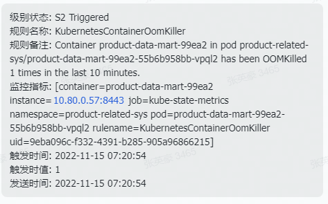
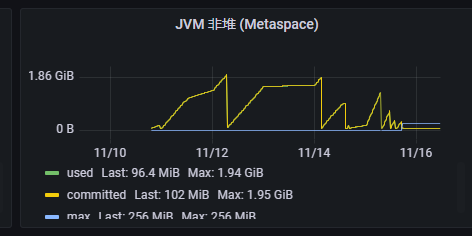
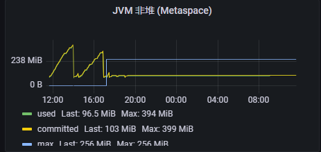

## 问题背景
### 线上收到异常告警


### 查看监控发现应用从启动后metaspace的占用就一直在增长，增长到一定限制后，pod重启

## 排查过程
metaspace存储的是类的结构信息，一直在增长基本上是因为类一直被重复加载，无法被卸载掉
给应用加上启动参数
```code
-XX:+TraceClassLoading -XX:+TraceClassUnloading
```
追踪这个应用在运行过程中类的加载和卸载信息，发现某几个接口运行的过程中会一直加载某个工厂类
```code
[Loaded com.**.***.***.classA_classB_ObjectFactory302966803037648304096626598839$4336 from jar:file:/usr/local/app/app.jar!/BOOT-INF/lib/orika-core-1.5.4.jar!/]
```
从最后的jar包信息我们知道是orika-core的类，接下来从这几个异常的接口入手，开始看代码，有下面可疑代码
```code
    private void insertMartMaterialMarketCorrelation(classA entity){
        ....
        MapperFacade mapperFacade = new DefaultMapperFactory.Builder().build().getMapperFacade();
        result = mapperFacade.map(entity, classB.class);
        ....
    }
```
推测可能是每一次请求这两行代码都会反射出一个classA和classB的组合类，且无法被回收，于是把这段代码提到类外面，作为静态资源后解决
```
public class C{
    static MapperFacade mapperFacade = new DefaultMapperFactory.Builder().build().getMapperFacade();
}
```
### 解决后metaspace平稳



